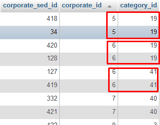

# mysql-tricks

## Query-1: Delete duplicate records based on two columns in MySql



```sql
DELETE
FROM
    corporate
WHERE
    corporate_sed_id IN(
    SELECT
        *
    FROM
        (
        SELECT
            MIN(corporate_sed_id)
        FROM
            corporate
        GROUP BY
            corporate_id,
            category_id
        HAVING
            COUNT(corporate_sed_id) > 1
    ) temp
)
```